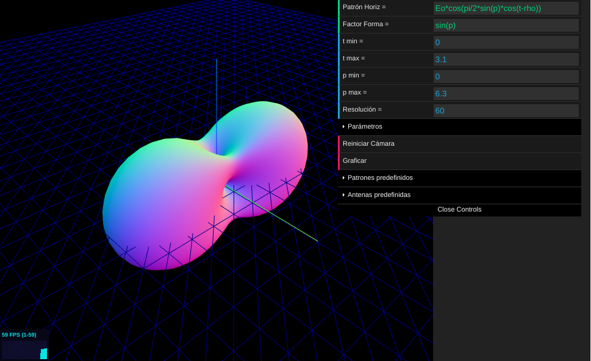

# teleco-patters
[](https://travis-ci.org/sytabaresa/teleco-patterns)

Dibujos de patrones de radiacion de antenas y arreglos de antenas



## Demo
Puedes ver la primer version [aquí](http://telecopatterns.tabares.me/)

## Uso

```bash
$ git clone https://github.com/sytabaresa/teleco-patters
$ cd teleco-patters
$ npm install
$ npm start
```

